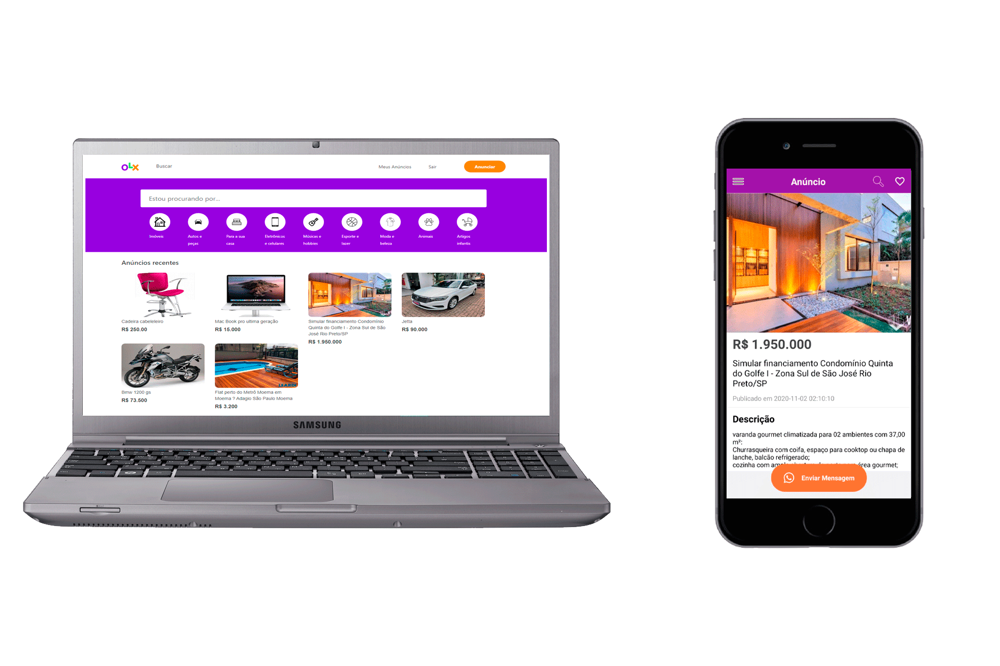

<h1 align="center">
    
    <br>Projeto fullstack OLX Clone<br/>
    Laravel | ReactJS | React Native
</h1> 

<p align="center">
  <a href="#bookmark-sobre">Sobre</a>&nbsp;&nbsp;&nbsp;|&nbsp;&nbsp;&nbsp;
  <a href="#rocket-tecnologias">Tecnologias</a>&nbsp;&nbsp;&nbsp;|&nbsp;&nbsp;&nbsp;
  <a href="#boom-como-executar">Como Executar</a>&nbsp;&nbsp;&nbsp;|&nbsp;&nbsp;&nbsp;
</p>

## :bookmark: Sobre

O **Projeto** é uma cópia do OLX com o desafio de criar todas suas funcionalidades tanto no frontend como no backend, feito para treinar habilidades **fullstack**.

Baseado no [projeto original de matheuspdias](https://github.com/matheuspdias/olx), com o frontend redesenhado pra acompanhar o layout atual da OLX (busca integrada, categorias, carrossel, avaliações de vendedor) e o modelo de dados do backend estendido (verificação de vendedor, avaliações, histórico de vendas, galeria de fotos).

## :rocket: Tecnologias
-  [Laravel](https://laravel.com/)
-  [ReactJS](https://reactjs.org/)
-  [React Native](http://facebook.github.io/react-native/)
-  [axios](https://github.com/axios/axios)
-  [Docker](https://www.docker.com/) / Docker Compose (ambiente de desenvolvimento)
-  MariaDB

## :boom: Como Executar

- ### **Pré-requisitos**

  - **[Docker Desktop](https://www.docker.com/products/docker-desktop/)** instalado e em execução
  - **[Git](https://git-scm.com/)** instalado

1. Clone o repositório:

```sh
git clone https://github.com/duanjesus/olx-clone.git
cd olx-clone
```

2. Suba os containers (API Laravel + MariaDB + frontend React):

```sh
docker compose up -d --build
```

Isso instala as dependências (composer e npm), roda as migrations e o seeder de dados de demonstração automaticamente. Na primeira vez pode levar alguns minutos.

3. Acesse:

- **Frontend**: http://localhost:5187
- **API**: http://localhost:8000/api

Para derrubar o ambiente:

```sh
docker compose down
```

### Aplicação mobile

O app mobile (React Native) não faz parte do ambiente Docker. Para rodá-lo:

```sh
cd mobile
yarn ou npm install
# em src/api.js, troque o baseURL para 'http://ipdasuamaquina:8000/api'
npx react-native run-android
```
